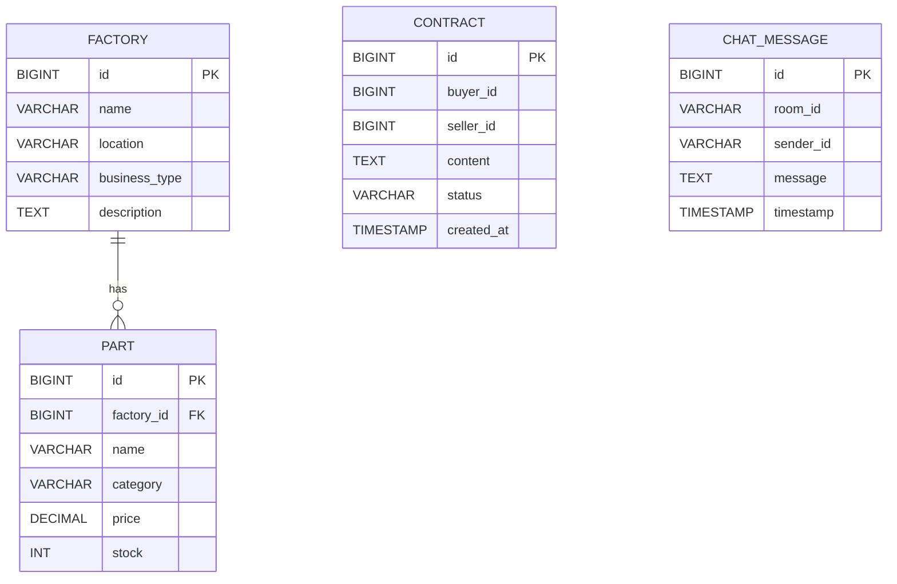
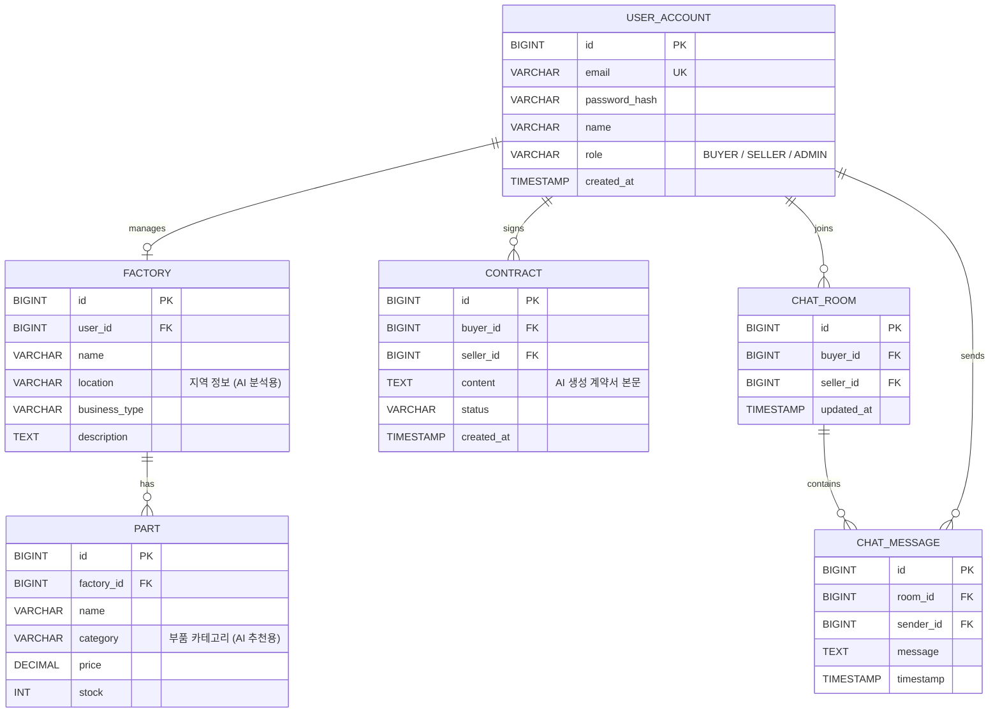

# Factory-Link ERD

아래는 두 가지 관점으로 정리한 ERD입니다.

- **현재 스키마(실제 구현 기준)**: `server-spring/src/main/resources/schema.sql`
- **권장 확장안(JWT/권한/채팅 고도화 기준)**: 인증/권한/1:1 채팅방 모델 반영

---

## 1) 현재 스키마 ERD (as-is)

---

## 2) 권장 확장 ERD (to-be)

사용자 제안안을 기반으로, SQL 예약어 충돌을 피하기 위해 테이블명은 `USER_ACCOUNT`로 표기했습니다.

## 왜 이 구조가 더 좋은가

- `USER_ACCOUNT` 기준으로 `CONTRACT`, `CHAT_ROOM`, `CHAT_MESSAGE`를 FK 연결해 데이터 정합성이 좋아집니다.
- 권한(`role`)을 DB에서 관리해 Spring Security/JWT와 자연스럽게 연결됩니다.
- `password_hash` 컬럼으로 BCrypt 해시 저장을 명확히 분리할 수 있습니다.
- `CHAT_ROOM`을 분리하면 1:1 대화 이력 조회, 최근 대화 정렬, 안 읽은 메시지 확장에 유리합니다.

## 적용 시 주의사항

- MariaDB에서 `USER`는 예약어 충돌 위험이 있어 `USER_ACCOUNT` 권장
- `email`은 `UNIQUE` 인덱스 필수
- `buyer_id`, `seller_id`, `sender_id`는 모두 `USER_ACCOUNT.id` FK로 통일
- 기존 `CHAT_MESSAGE.room_id`가 문자열이면 숫자 FK로 마이그레이션 필요
